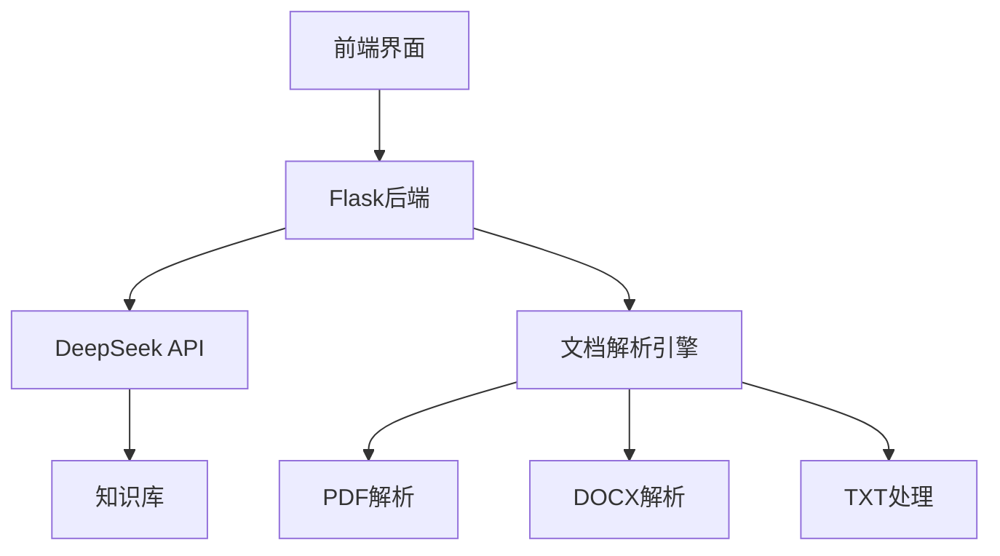

# 纪检监察智能助手系统


## 项目简介

纪检监察智能助手系统是基于DeepSeek大模型构建的专业AI辅助平台，专为电网企业纪检监察工作设计。系统整合党纪法规、企业规章和典型案例知识库，提供智能问答、文档分析和决策支持等功能，助力纪检监察工作标准化、智能化转型。

## 核心功能

### 🧠 智能问答系统
- 党纪法规条款精准检索与解读
- 违纪行为量纪标准智能建议
- 典型案例匹配与分析

### 📄 文档智能处理
- 支持PDF/DOCX/TXT格式上传
- 自动提取文档关键信息
- 生成结构化摘要与关键词

### ✍️ 文书辅助工具
- 审查调查报告规范性检查
- 文书模板智能生成
- 常用文书自动填充

### 📊 数据分析看板
- 违纪类型统计可视化
- 执纪趋势分析
- 风险预警提示

## 技术架构



## 快速开始

### 环境配置

1. 克隆仓库：
```bash
git clone https://github.com/your-repo/discipline-inspection-ai.git
cd discipline-inspection-ai
```

2. 安装依赖：
```bash
pip install -r requirements.txt
```

3. 配置环境变量：
```ini
# .env 文件示例
DEEPSEEK_API_KEY=your_api_key_here
MODEL_NAME=deepseek-chat
MAX_TOKENS=2000
```

### 运行应用

开发模式：
```bash
python app.py
```

生产模式：
```bash
gunicorn -w 4 -b 0.0.0.0:5000 app:app
```

## 使用指南

1. **上传文档**：
   - 点击侧边栏上传按钮
   - 选择PDF/DOCX/TXT格式文件
   - 系统自动解析并显示摘要

2. **智能问答**：
   ```text
   示例问题：
   - 如何认定违反廉洁纪律的行为？
   - 同一违纪行为触犯多个条款如何处理？
   - 请根据上传文档分析违纪性质
   ```

3. **文书辅助**：
   - 在聊天框输入"生成审查报告模板"
   - 系统返回标准模板框架
   - 根据提示补充具体内容

## 项目结构

```
discipline-inspection-ai/
├── app.py                # 主应用文件
├── requirements.txt      # 依赖清单
├── static/
│   └── style.css         # 样式表
├── templates/
│   └── index.html        # 前端页面
├── uploads/              # 文档存储目录
└── README.md             # 项目文档
```

## 贡献指南

欢迎通过以下方式参与贡献：

1. 提交Issue报告问题或建议
2. Fork仓库并提交Pull Request
3. 完善文档或添加测试用例

贡献前请阅读：
- [代码风格指南](STYLE_GUIDE.md)
- [贡献者公约](CODE_OF_CONDUCT.md)

## 许可证

本项目采用 [MIT License](LICENSE)。

## 联系我们

如有任何问题，请联系：
- 项目维护者：your-email@example.com
- 纪检监察办公室：discipline@example.com

---

**纪检监察信息化建设五年规划 - 电网+大模型数据处理系统**  
构建全量知识库与大模型技术体系，推动纪检监督工作智能化转型
